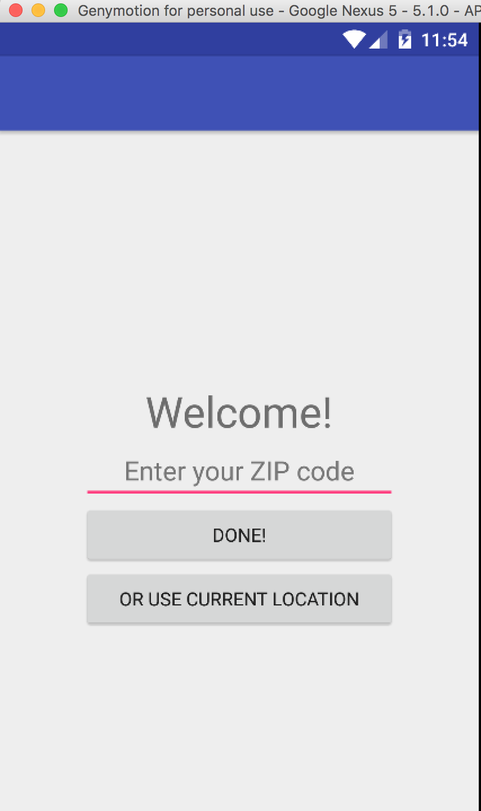

# PROG 02: Represent!

This is an android application that helps voters know their representatives and senators. This app searches for relevant information based on users' zipcode or current location and interacts with users through both smart phone and smart watch. The shake feature generates randomized zipcode/location and updates the information accordingly. 

## Authors

Cady Xu ([cxu@berkeley.edu](mailto:cxu@berkeley.edu))

## Demo Video

See [your demo video title here] (https://link_to_your_video)

## Screenshots

Main View on Phone:  

Congressional View on Phone:  

Detail View on Phone:  

Main View on Watch:  

Rep View on Watch:  

Vote View on Watch:  

## Acknowledgments

* Hat tip to anyone who's code was used
http://stackoverflow.com/questions/2317428/android-i-want-to-shake-it  
http://developer.android.com/guide/topics/sensors/sensors_overview.html  
* Any other support
Many Thanks to Section TA: Jasper O'Leary 
